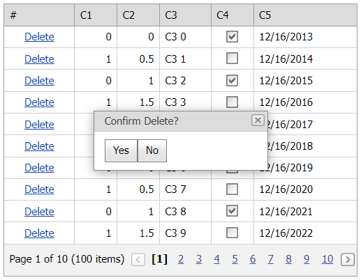

# Grid View for ASP.NET MVC - How to use a popup control to show a confirmation dialog box
<!-- run online -->
**[[Run Online]](https://codecentral.devexpress.com/t116360/)**
<!-- run online end -->

This example demonstrates how to create a custom **Delete** button and show a confirmation pop-up window on a button click.



## Overview

Create a custom **Delete** button and handle the grid's [CustomButtonClick](https://docs.devexpress.com/AspNet/js-ASPxClientGridView.CustomButtonClick) event to show a confirmation pop-up window on a button click.

```cshtml
GridViewCommandColumnCustomButton customButton = new GridViewCommandColumnCustomButton(){
    ID = "deleteButton", Text = "Delete" };
settings.CommandColumn.CustomButtons.Add(customButton);
settings.ClientSideEvents.CustomButtonClick = "function(s, e) { OnCustomButtonClick(s, e); }";
```

```js
var visibleIndex;
function OnCustomButtonClick(s, e) {
    if (e.buttonID = "deleteButton") {
        visibleIndex = e.visibleIndex;
        popup.Show();
    }
}
```

When a user clicks the **Yes** button, the grid deletes the row specified by its visible index.

```js
function OnClickYes(s, e) {
    GridView.DeleteRow(visibleIndex);
    popup.Hide();
}
function OnClickNo(s, e) {
    popup.Hide();
}
```

## Files to Review

* [GridViewPartial.cs](./CS/GridViewBatchEdit/Views/Home/_GridViewPartial.cshtml) (VB: [GridViewPartial.vb](./VB/GridViewBatchEdit/Views/Home/_GridViewPartial.vbhtml))
* [Index.cs](./CS/GridViewBatchEdit/Views/Home/Index.cshtml) (VB: [Index.vb](./VB/GridViewBatchEdit/Views/Home/Index.vbhtml))
* [HomeController.cs](./CS/GridViewBatchEdit/Controllers/HomeController.cs) (VB: [HomeController.vb](./VB/GridViewBatchEdit/Controllers/HomeController.vb))

## More Examples

* [GridView for Web Forms - How to use ASPxPopupControl to show a confirmation dialog](https://github.com/DevExpress-Examples/asp-net-web-forms-gridview-confirmation-dialog-with-aspxpopupcontrol)
